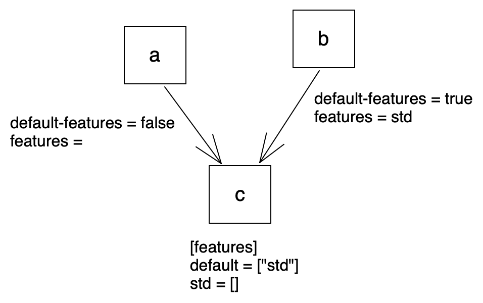

# cargo workspace feature selection bug

This issue is: https://github.com/rust-lang/cargo/issues/10636

Cargo workspaces do not resolve features correctly and this repo contains an example that demonstrates why. This problem exists when using resolver v1 or v2. The workspace in this repo is configured with resolver v2.

This repo contains three crates `a`, `b`, and `c` where `a` and `b` are dependent on `c`. `a` depends on `c` with default-features disabled. `b` depends on `c` with default-features enabled. `c` has one default feature, `std`.



`c` contains some invalid code when built without its `std` feature. `c` contains this invalid code. The code is invalid because when the `std` feature is disabled, the `no_std` attribute is enabled and the `String` type is unknown.

```rust
#![cfg_attr(not(feature = "std"), no_std)]

pub type CS = String;
```

When building the workspace which builds all crates, all tests pass because the default features are enabled, enabling the `std` feature, even for the `a` crate that has `std` disabled. To try this out, run this command:

```
$ cargo build --all
   Compiling c v0.1.0 (/Users/dev/workspace/c)
   Compiling b v0.1.0 (/Users/dev/workspace/b)
   Compiling a v0.1.0 (/Users/dev/workspace/a)
    Finished dev [unoptimized + debuginfo] target(s) in 0.40s
```

When building individual crates, crate `a` fails to compile and crate `c` fails to compile when explicitly told to build without the `std` feature.

```
$ cargo build -p c
    Checking c v0.1.0 (/Users/dev/workspace/c)
    Finished dev [unoptimized + debuginfo] target(s) in 0.00s
```

```
$ cargo build -p c --no-default-features
   Compiling c v0.1.0 (/Users/dev/workspace/c)
error[E0412]: cannot find type `String` in this scope
 --> c/src/lib.rs:3:15
  |
3 | pub type CS = String;
  |               ^^^^^^ not found in this scope

For more information about this error, try `rustc --explain E0412`.
error: could not compile `c` due to previous error

```

```
$ cargo build -p a
   Compiling c v0.1.0 (/Users/dev/workspace/c)
error[E0412]: cannot find type `String` in this scope
 --> c/src/lib.rs:3:15
  |
3 | pub type CS = String;
  |               ^^^^^^ not found in this scope

For more information about this error, try `rustc --explain E0412`.
error: could not compile `c` due to previous error
```

```
$ cargo build -p b
    Checking c v0.1.0 (/Users/dev/workspace/c)
    Checking b v0.1.0 (/Users/dev/workspace/b)
    Finished dev [unoptimized + debuginfo] target(s) in 0.00s
```
